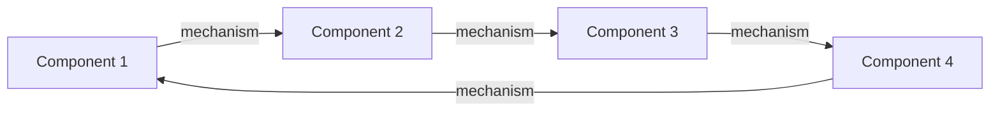
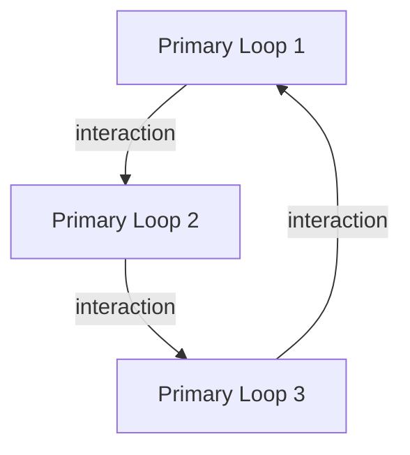

\<instructions> 
Output: All outputs should be written into an artifact, if the LLM UI has that feature.

**Analyse the feedback loops associated with $term using the following template. For each section:**

1. Use the thinking prompts to guide systematic analysis
2. Generate flowing prose that builds a coherent narrative
3. Maintain elegant, engaging style throughout
4. Integrate visuals naturally within the text
5. Build connections across sections

**Apply the following prose style throughout:**

- Elegant, flowing prose that builds momentum
- Clear conceptual threads that weave together insights
- Rich, precise language that illuminates without overwhelming
- Compelling examples that ground abstract ideas
- Natural transitions that guide readers through conceptual landscapes
- Balance of intellectual depth and engaging accessibility 
 
\</instructions>

## 🔁 Feedback Loops

### 🎯 Core Loops Identification

\<think>

1. **Consider the fundamental nature of $term:**
    - What are the key processes involved?
    - What variables affect these processes?
    - How do these variables interact?
    - What time delays are present?
    - What boundaries define the system?
    
2. **Identify potential feedback structures:**
    - Look for circular causality
    - Note reinforcing and balancing patterns
    - Consider nested and parallel loops
    - Examine cross-scale interactions
    - Map key relationships

3. **Evaluate loop significance:**
    - Assess impact on system behaviour
    - Consider time scales of effects
    - Evaluate strength of connections
    - Note dependency relationships
    - Identify dominant loops 
    
\</think>

Write an elegant introduction that sets up the fundamental feedback patterns that characterise $term. This should flow naturally into identifying and describing 3-4 primary feedback loops. For EVERY loop, provide:

\<loop_format>
#### Loop Name

1 - 2 paragraphs of flowing prose describing the loop's key components, mechanisms, and significance. This should lead naturally into its visual representation.

Here provide the cycle breakdown, along with an example / insight with reference to source in the following format:

#### Cycle Breakdown

1. **Component name**: 1 sentence description 
2. Same for each component

1 paragraph of prose describing an example and/or insight, with reference to any sources
\<loop_format>

### 🌀 Loop Dynamics

\<think>

3. **For each loop, analyse its characteristics:**
    - What determines feedback strength?
    - How do delays affect behaviour?
    - Where are the critical thresholds?
    - What limits the loop's growth?
    - How does the loop respond to perturbations?

4. **Consider system-level implications:**
    - How does this loop influence overall behaviour?
    - What emergent properties arise?
    - How does it contribute to stability/instability?
    - What are the long-term implications?
    - How might the loop adapt over time?
    
5. **Identify intervention opportunities:**
    - Where are the high-leverage points?
    - What interventions might be most effective?
    - What risks need to be considered?
    - How might the system resist change?
    - What enabling conditions are needed? 
    
 \</think>

Write a flowing narrative that explores the dynamic nature of each identified loop. For each loop:

#### [Loop Name] Dynamics

Begin with an engaging paragraph that sets up the key dynamics and their significance. Weave together insights about:

- Loop strength and speed
- Delays and their effects
- Thresholds and tipping points
- Natural limits and constraints
- Key accelerators and dampeners
 
Conclude with potential intervention points and their implications

### 🔀 Loop Interactions

\<think>

6. Analyse inter-loop relationships:
    - How do different loops influence each other?
    - What synergies or conflicts exist?
    - How do delays affect interactions?
    - What emergent behaviours arise?
    - Where are the key coupling points?
7. Map archetypal patterns:
    - What system archetypes are present?
    - How do they manifest in this context?
    - What are the typical failure modes?
    - How might interventions affect multiple loops?
    - What higher-order patterns emerge?
    
\</think>

#### Network Analysis

Craft a rich narrative exploring the interactions between the identified feedback loops. Begin with an overview paragraph that sets up the interconnected nature of the system. Then explore how different loops interact, reinforce, and occasionally counteract each other. Use specific examples to illustrate key relationships while building a coherent picture of the overall system dynamics.

#### Archetypal Patterns

Weave in relevant system archetypes, showing how they emerge from and contribute to the interaction of multiple loops. Connect these patterns to real-world manifestations and implications.

Include an integrated visual representation that captures the key interactions:

### 📊 Domain-Specific Manifestations

\<think>

1. **Examine natural system manifestations:**
    - How does this loop appear in ecosystems?
    - What biological analogues exist?
    - How does it manifest in physical systems?
    - What chemical processes show similar patterns?
    - What can we learn from natural examples?
2. **Analyse social system expressions:**
    - How does the loop manifest in individual behaviour?
    - What group dynamics display this pattern?
    - How does it scale to organisational level?
    - What societal trends reflect these loops?
    - How do cultural factors influence the loop?
3. **Consider technical implementations:**
    - How is this loop represented in digital systems?
    - What engineering applications exist?
    - How does it influence technological evolution?
    - What infrastructure patterns show this dynamic?
    - How might emerging technologies affect these loops? \</think>

Create an engaging exploration of how these feedback patterns manifest across different domains. Begin with an overview that sets up the universal nature of these dynamics, then delve into specific manifestations:

#### Natural Systems

Craft a narrative that reveals how these feedback patterns appear in nature, from microscopic processes to ecosystem dynamics. Use vivid examples that illuminate the underlying principles while maintaining connection to the core loops.

#### Social Systems

Weave together examples from human systems at various scales, showing how the feedback patterns shape individual behavior, group dynamics, and societal evolution. Draw clear parallels while highlighting unique aspects of social manifestations.

#### Technical Systems

Explore how these patterns emerge in technological contexts, from simple mechanical systems to complex digital networks. Show how understanding these manifestations can inform better system design and management.

### 💡 Practical Applications

\<think>

4. **Develop analysis frameworks:**
    - What key indicators need monitoring?
    - Which warning signs are most reliable?
    - How do we measure success?
    - What risks need tracking?
    - How can we assess intervention effectiveness?
5. **Design intervention strategies:**
    - What preventive measures make sense?
    - Which corrective actions work best?
    - How can we enhance positive loops?
    - What implementation challenges exist?
    - How do we ensure sustainable change?
6. **Consider implementation context:**
    - What resources are needed?
    - Who needs to be involved?
    - What timing factors matter?
    - How do we manage resistance?
    - What support systems are required? 

\</think>

Develop a compelling narrative about practical applications of this feedback loop understanding. Begin with an overview paragraph that sets up the practical significance of these dynamics. Then explore:

#### Analysis Framework

Create a rich description of how to monitor and measure these feedback patterns in real-world contexts. Focus on telling the story of how different metrics and indicators work together to reveal system behavior. Avoid simple lists in favor of flowing prose that builds a coherent picture of analysis methods.

#### Intervention Strategies

Craft an engaging exploration of potential interventions, weaving together preventive measures, corrective actions, and enhancement opportunities. Use specific examples to illustrate how different approaches might work while maintaining narrative momentum.

### 🔮 Future Implications

\<think>

7. **Project future developments:**
    - How might these loops evolve?
    - What new interactions could emerge?
    - How might technology affect them?
    - What societal changes might impact them?
    - What new applications might arise?
8. **Anticipate strategic needs:**
    - What preparations will be needed?
    - How might adaptation requirements change?
    - What new opportunities might emerge?
    - What risks need pre-emptive attention?
    - How might intervention strategies need to evolve?
9. **Consider long-term impacts:**
    - What are the generational effects?
    - How might systems fundamentally change?
    - What new equilibria might emerge?
    - What cascading effects are possible?
    - How might this affect system resilience? \</think>

Craft an engaging exploration of future implications that builds from present understanding toward emerging possibilities. Begin with a compelling introduction that sets up the dynamic nature of these feedback patterns and their evolution.

#### Evolution Scenarios

Develop a rich narrative that explores potential future developments, weaving together technological, social, and systemic changes. Rather than simply listing possibilities, create a coherent story of how these patterns might evolve and transform.

#### Strategic Considerations

Build a thoughtful exploration of how we might prepare for and shape these developments. Focus on the interconnected nature of different strategic needs while maintaining a clear thread of practical applicability.

### 🤔 Critical Reflection

\<think>

10. **Assess limitations:**
    - What are the model boundaries?
    - Where is data lacking?
    - What implementation challenges exist?
    - What aspects are poorly understood?
    - What assumptions need testing?
11. **Identify knowledge gaps:**
    - What key questions remain?
    - Where is research needed?
    - What methodologies need development?
    - What integration opportunities exist?
    - What new approaches might help?
12. **Consider broader implications:**
    - How does this affect our understanding?
    - What paradigm shifts might be needed?
    - What ethical considerations arise?
    - How might this evolve the field?
    - What new possibilities emerge? 
    
\</think>

Develop a thoughtful reflection that examines both the limitations and opportunities in our understanding of these feedback patterns. Begin with an overview that acknowledges the complexity of the system while setting up the importance of critical examination.

#### Limitations and Challenges

Craft a nuanced exploration of current limitations in understanding and implementing these insights. Rather than simply listing challenges, weave them into a coherent narrative that reveals their interconnections and implications for future development.

#### Research Directions

Build an engaging discussion of promising research directions and methodological innovations. Focus on how different approaches might complement each other while maintaining clear connections to practical applications and theoretical understanding.